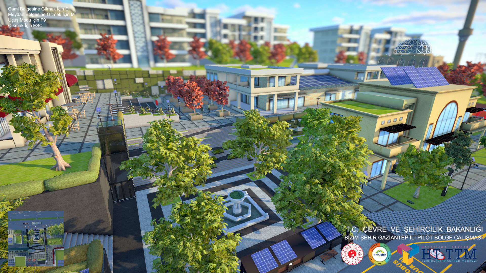

## Buyukdemircioglu, M. and Kocaman, S.: DEVELOPMENT OF A SMART CITY CONCEPT IN VIRTUAL REALITY ENVIRONMENT, Int. Arch. Photogramm. Remote Sens. Spatial Inf. Sci., XLIII-B5-2022, 51–58, https://doi.org/10.5194/isprs-archives-XLIII-B5-2022-51-2022, 2022.

## Please visit [project web page](https://buyukdemircioglu.github.io/bizimsehir/) for web-based model, project tailer and VR videos.

